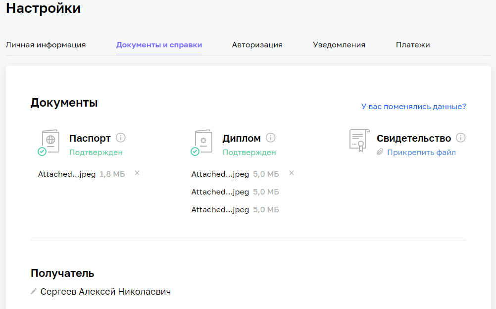

# Домашнее задание к занятию «Индексы» - Сергеев Алексей

### Инструкция по выполнению домашнего задания

1. Сделайте fork [репозитория c шаблоном решения](https://github.com/netology-code/sys-pattern-homework) к себе в Github и переименуйте его по названию или номеру занятия, например, https://github.com/имя-вашего-репозитория/gitlab-hw или https://github.com/имя-вашего-репозитория/8-03-hw).
2. Выполните клонирование этого репозитория к себе на ПК с помощью команды `git clone`.
3. Выполните домашнее задание и заполните у себя локально этот файл README.md:
   - впишите вверху название занятия и ваши фамилию и имя;
   - в каждом задании добавьте решение в требуемом виде: текст/код/скриншоты/ссылка;
   - для корректного добавления скриншотов воспользуйтесь инструкцией [«Как вставить скриншот в шаблон с решением»](https://github.com/netology-code/sys-pattern-homework/blob/main/screen-instruction.md);
   - при оформлении используйте возможности языка разметки md. Коротко об этом можно посмотреть в [инструкции по MarkDown](https://github.com/netology-code/sys-pattern-homework/blob/main/md-instruction.md).
4. После завершения работы над домашним заданием сделайте коммит (`git commit -m "comment"`) и отправьте его на Github (`git push origin`).
5. Для проверки домашнего задания преподавателем в личном кабинете прикрепите и отправьте ссылку на решение в виде md-файла в вашем Github.
6. Любые вопросы задавайте в чате учебной группы и/или в разделе «Вопросы по заданию» в личном кабинете.

Желаем успехов в выполнении домашнего задания.

### Задание 1

Напишите запрос к учебной базе данных, который вернёт процентное отношение общего размера всех индексов к общему размеру всех таблиц.

### Ответ
```SQL
SELECT SUM(INDEX_LENGTH)/SUM(DATA_LENGTH)
FROM INFORMATION_SCHEMA.TABLES
WHERE TABLE_SCHEMA = 'sakila' AND TABLE_TYPE = 'BASE TABLE';
```



### Задание 2

Выполните explain analyze следующего запроса:
```sql
select distinct concat(c.last_name, ' ', c.first_name), sum(p.amount) over (partition by c.customer_id, f.title)
from payment p, rental r, customer c, inventory i, film f
where date(p.payment_date) = '2005-07-30' and p.payment_date = r.rental_date and r.customer_id = c.customer_id and i.inventory_id = r.inventory_id
```
- перечислите узкие места;
- оптимизируйте запрос: внесите корректировки по использованию операторов, при необходимости добавьте индексы.

### Ответ
Оригинальный скрипт выдает результат очень долго из-за функции over
```SQL
EXPLAIN ANALYZE
select distinct concat(c.last_name, ' ', c.first_name), sum(p.amount) over (partition by c.customer_id, f.title)
from payment p, rental r, customer c, inventory i, film f
where date(p.payment_date) = '2005-07-30' and p.payment_date = r.rental_date and r.customer_id = c.customer_id and i.inventory_id = r.inventory_id;

-> Table scan on <temporary>  (cost=2.5..2.5 rows=0) (actual time=8554..8554 rows=391 loops=1)
    -> Temporary table with deduplication  (cost=0..0 rows=0) (actual time=8554..8554 rows=391 loops=1)
        -> Window aggregate with buffering: sum(payment.amount) OVER (PARTITION BY c.customer_id,f.title )   (actual time=4426..8288 rows=642000 loops=1)
            -> Sort: c.customer_id, f.title  (actual time=4425..4523 rows=642000 loops=1)
                -> Stream results  (cost=10.8e+6 rows=16.7e+6) (actual time=1.28..2496 rows=642000 loops=1)
                    -> Nested loop inner join  (cost=10.8e+6 rows=16.7e+6) (actual time=1.27..2150 rows=642000 loops=1)
                        -> Nested loop inner join  (cost=9.12e+6 rows=16.7e+6) (actual time=1.27..1920 rows=642000 loops=1)
                            -> Nested loop inner join  (cost=7.45e+6 rows=16.7e+6) (actual time=1.26..1662 rows=642000 loops=1)
                                -> Inner hash join (no condition)  (cost=1.65e+6 rows=16.5e+6) (actual time=1.24..59.1 rows=634000 loops=1)
                                    -> Filter: (cast(p.payment_date as date) = '2005-07-30')  (cost=1.72 rows=16500) (actual time=0.321..9.47 rows=634 loops=1)
                                        -> Table scan on p  (cost=1.72 rows=16500) (actual time=0.311..4.28 rows=16044 loops=1)
                                    -> Hash
                                        -> Covering index scan on f using idx_title  (cost=112 rows=1000) (actual time=0.488..0.767 rows=1000 loops=1)
                                -> Covering index lookup on r using rental_date (rental_date=p.payment_date)  (cost=0.25 rows=1.01) (actual time=0.00175..0.00236 rows=1.01 loops=634000)
                            -> Single-row index lookup on c using PRIMARY (customer_id=r.customer_id)  (cost=250e-6 rows=1) (actual time=186e-6..216e-6 rows=1 loops=642000)
                        -> Single-row covering index lookup on i using PRIMARY (inventory_id=r.inventory_id)  (cost=250e-6 rows=1) (actual time=172e-6..194e-6 rows=1 loops=642000)
```
    
Поэтому заменяем ее на GROUP BY и заменяем несколько условий на JOIN
```SQL
EXPlAIN ANALYZE    
select concat(c.last_name, ' ', c.first_name) as fi, sum(p.amount)
from customer c
JOIN rental r ON r.customer_id = c.customer_id
JOIN inventory i ON i.inventory_id = r.inventory_id
JOIN payment p ON p.payment_date = r.rental_date 
where date(p.payment_date) = '2005-07-30'
GROUP BY c.customer_id;

-> Table scan on <temporary>  (actual time=6.63..6.66 rows=391 loops=1)
    -> Aggregate using temporary table  (actual time=6.63..6.63 rows=391 loops=1)
        -> Nested loop inner join  (cost=19158 rows=16698) (actual time=0.231..6.26 rows=642 loops=1)
            -> Nested loop inner join  (cost=13314 rows=16698) (actual time=0.228..5.49 rows=642 loops=1)
                -> Nested loop inner join  (cost=7469 rows=16698) (actual time=0.222..4.91 rows=642 loops=1)
                    -> Filter: (cast(p.payment_date as date) = '2005-07-30')  (cost=1674 rows=16500) (actual time=0.211..3.83 rows=634 loops=1)
                        -> Table scan on p  (cost=1674 rows=16500) (actual time=0.204..2.93 rows=16044 loops=1)
                    -> Covering index lookup on r using rental_date (rental_date=p.payment_date)  (cost=0.25 rows=1.01) (actual time=0.00117..0.00154 rows=1.01 loops=634)
                -> Single-row index lookup on c using PRIMARY (customer_id=r.customer_id)  (cost=0.25 rows=1) (actual time=760e-6..779e-6 rows=1 loops=642)
            -> Single-row covering index lookup on i using PRIMARY (inventory_id=r.inventory_id)  (cost=0.25 rows=1) (actual time=0.00107..0.00109 rows=1 loops=642)

```

## Дополнительные задания (со звёздочкой*)
Эти задания дополнительные, то есть не обязательные к выполнению, и никак не повлияют на получение вами зачёта по этому домашнему заданию. Вы можете их выполнить, если хотите глубже шире разобраться в материале.

### Задание 3*

Самостоятельно изучите, какие типы индексов используются в PostgreSQL. Перечислите те индексы, которые используются в PostgreSQL, а в MySQL — нет.

*Приведите ответ в свободной форме.*

Индексы, которые используются в PostgreSQL, но в MySQL их нет:
	Bitmap index. Метод битовых индексов заключается в создании отдельных битовых карт (последовательность 0 и 1) для каждого возможного значения столбца, где каждому биту соответствует строка с индексируемым значением. 1
	Partial index. 15 Это индекс, построенный на части таблицы, удовлетворяющей определённому условию самого индекса. Он создан для уменьшения размера индекса. 1
	Function based index. 15 Индексы, ключи которых хранят результат пользовательских функций. Например, при сравнении строковых данных без учёта регистра символов часто используется функция UPPER. Создание функционального индекса с этой функцией улучшает эффективность таких сравнений. 1